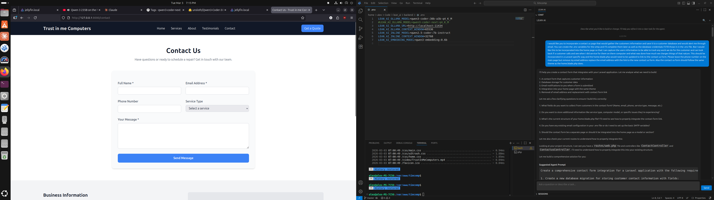

# Lean AI

Agentic coding assistant powered by a single local LLM via Ollama. Plan well, give the LLM tools, let it work.

## Philosophy

Lean AI extracts the proven ideas from [single_ai](../single_ai) into a clean, minimal codebase:

- **Direct agentic execution** — give the LLM the task and tools, let it explore, plan, and execute in one continuous conversation
- **Tree-sitter AST parsing** instead of regex patterns for source code analysis
- **Native tool calling** via Ollama — no text-based SEARCH/REPLACE parsing
- **Interactive prompt building** — chat mode helps users craft detailed prompts before sending to the agent
- **Minimal persistence** — 2 SQLite tables instead of ORM models
- **Trust the LLM** — no stagnation detection, no implementation review loops, no rubric scoring



## Quick Start

### Backend

```bash
cd backend
pip install -e ".[dev]"

# Optional: knowledge base format support (EPUB, PDF, Word)
pip install -e ".[dev,knowledge]"

# Start the server
uvicorn lean_ai.main:app --reload --port 8422
```

### VSCodium Extension

```bash
cd extension
npm install
npm run build

# Package the .vsix file
npx vsce package --no-dependencies
```

This produces a file like `lean-ai-0.1.2.vsix`. To install it in VSCodium:

```bash
codium --install-extension lean-ai-0.1.2.vsix
```

Or from the VSCodium UI: **Extensions** sidebar → `⋯` menu (top-right) → **Install from VSIX...** → select the `.vsix` file.

Reload VSCodium after installation.

## Configuration

All settings use the `LEAN_AI_` environment variable prefix. Create a `backend/.env` file:

```env
# Primary model
LEAN_AI_OLLAMA_URL=http://localhost:11434
LEAN_AI_OLLAMA_MODEL=qwen3-coder:30b
LEAN_AI_OLLAMA_CONTEXT_WINDOW=131072

# Inline predictions (optional — separate smaller model)
LEAN_AI_INLINE_MODEL=qwen2.5-coder:7b-instruct
LEAN_AI_INLINE_CONTEXT_WINDOW=32768

# Embeddings
LEAN_AI_EMBEDDING_MODEL=qwen3-embedding:0.6b
LEAN_AI_ENABLE_EMBEDDINGS=true
```

### Complete Configuration Reference

#### Primary Model

| Variable | Default | Description |
|---|---|---|
| `LEAN_AI_OLLAMA_URL` | `http://localhost:11434` | Ollama API endpoint |
| `LEAN_AI_OLLAMA_MODEL` | `qwen3-coder:30b` | Primary model for planning and implementation |
| `LEAN_AI_OLLAMA_TEMPERATURE` | `0.0` | Sampling temperature for the primary model |
| `LEAN_AI_OLLAMA_CONTEXT_WINDOW` | `131072` | Total context window size (single source of truth — other limits derive from this) |
| `LEAN_AI_OLLAMA_MAX_TOKENS` | *(derived: 25% of context window)* | Max output tokens per LLM call |

#### Inline Prediction Model

| Variable | Default | Description |
|---|---|---|
| `LEAN_AI_INLINE_MODEL` | *(empty — disabled)* | Separate model for Copilot-style inline completions |
| `LEAN_AI_INLINE_OLLAMA_URL` | *(falls back to OLLAMA_URL)* | Ollama instance for the inline model |
| `LEAN_AI_INLINE_CONTEXT_WINDOW` | *(derived: 12.5% of context window)* | Context window for inline predictions |
| `LEAN_AI_INLINE_MAX_TOKENS` | `256` | Max tokens for inline completions |
| `LEAN_AI_INLINE_TEMPERATURE` | `0.0` | Temperature for inline predictions |

#### Embedding Model

| Variable | Default | Description |
|---|---|---|
| `LEAN_AI_EMBEDDING_MODEL` | `qwen3-embedding:0.6b` | Model for semantic search embeddings |
| `LEAN_AI_ENABLE_EMBEDDINGS` | `true` | Enable embedding generation and RRF hybrid search |
| `LEAN_AI_EMBEDDING_OLLAMA_URL` | *(falls back to OLLAMA_URL)* | Ollama instance for embeddings |

#### Indexer

| Variable | Default | Description |
|---|---|---|
| `LEAN_AI_INDEX_DIR` | `.lean_ai_index` | Whoosh search index directory name |
| `LEAN_AI_CHUNK_MAX_LINES` | `50` | Maximum lines per code chunk for indexing |
| `LEAN_AI_CHUNK_OVERLAP_LINES` | `10` | Overlap lines between adjacent chunks |

#### Internet / Search

| Variable | Default | Description |
|---|---|---|
| `LEAN_AI_SEARCH_PROVIDER` | `duckduckgo` | Search provider (`duckduckgo` or `searxng`) |
| `LEAN_AI_SEARCH_API_URL` | *(empty)* | SearXNG API URL (if using SearXNG) |
| `LEAN_AI_SEARCH_API_KEY` | *(empty)* | SearXNG API key (if using SearXNG) |
| `LEAN_AI_INTERNET_TIMEOUT_SECONDS` | `30` | Timeout for internet requests |

#### Project Context

| Variable | Default | Description |
|---|---|---|
| `LEAN_AI_ENABLE_PROJECT_CONTEXT` | `true` | Generate `.lean_ai/project_context.md` on workspace init |
| `LEAN_AI_ENABLE_MULTI_ROUND_CONTEXT` | `true` | Use multi-round LLM calls for richer context generation |

#### Knowledge Base

| Variable | Default | Description |
|---|---|---|
| `LEAN_AI_KNOWLEDGE_DIR` | `.lean_ai/knowledge` | Directory for domain documents (EPUB, PDF, Word, Markdown, etc.) |
| `LEAN_AI_KNOWLEDGE_INDEX_DIR` | `.lean_ai_knowledge_index` | Whoosh index directory for knowledge base |

#### Implementation

| Variable | Default | Description |
|---|---|---|
| `LEAN_AI_IMPLEMENTATION_MAX_TURNS` | `50` | Max tool-calling turns per agent session |
| `LEAN_AI_IMPLEMENTATION_MAX_TOKENS` | *(derived: 25% of context window)* | Max tokens per LLM turn during implementation |

#### Chat

| Variable | Default | Description |
|---|---|---|
| `LEAN_AI_CHAT_TEMPERATURE` | `0.3` | Temperature for the `/chat` endpoint |

#### Tool Execution

| Variable | Default | Description |
|---|---|---|
| `LEAN_AI_TOOL_TIMEOUT_SECONDS` | `60` | Timeout for shell tool execution (tests, lint, format) |

#### LLM Retry

| Variable | Default | Description |
|---|---|---|
| `LEAN_AI_LLM_RETRY_MAX` | `3` | Max retries for transient LLM errors |
| `LEAN_AI_LLM_RETRY_BASE_DELAY` | `2.0` | Base delay (seconds) for exponential backoff |

#### Server

| Variable | Default | Description |
|---|---|---|
| `LEAN_AI_HOST` | `127.0.0.1` | Server bind address |
| `LEAN_AI_PORT` | `8422` | Server port |

### VSCodium Extension Settings

| Setting | Default | Description |
|---|---|---|
| `lean-ai.backendUrl` | `http://localhost:8422` | Backend server URL |
| `lean-ai.enableInlinePredictions` | `true` | Enable Copilot-style inline completions |
| `lean-ai.autoStartBackend` | `true` | Auto-start the Python backend on extension activation |
| `lean-ai.pythonPath` | `python` | Path to Python interpreter |
| `lean-ai.backendDir` | *(auto-detect)* | Path to backend directory |
| `lean-ai.chatFontSize` | `13` | Font size in pixels for chat messages (10–20) |

## How It Works

### Workflow

1. **User submits a task** via the VSCodium sidebar chat or `/agent` command
2. **Chat mode (optional)** — the chat helps build a detailed, specific prompt through interactive Q&A before handing it to the agent
3. **Agent execution** — the LLM receives the task, project context, and tools, then works autonomously in one continuous tool-calling loop: exploring the codebase, reading files, making edits, running tests
4. **Nudge recovery** — if the model stops after gathering context without making changes, the system nudges it to continue
5. **Done** — summary of changes, files modified, and diffs streamed back to the user

### Agent Tools

During execution, the LLM has access to these tools:

| Tool | Description |
|---|---|
| `create_file` | Create a new file with full content |
| `edit_file` | Edit an existing file via find-and-replace |
| `read_file` | Read file contents with optional line range |
| `run_tests` | Execute test commands (with safety gate) |
| `run_lint` | Run linting checks (with safety gate) |
| `format_code` | Run code formatter (with safety gate) |
| `list_directory` | List files in a directory |
| `directory_tree` | Show recursive file tree |

Shell commands (`run_tests`, `run_lint`, `format_code`) pass through a safety gate that blocks dangerous commands and requires user approval for potentially risky ones.

## Slash Commands

Commands available in the VSCodium sidebar chat:

| Command | Description |
|---|---|
| `/init` | Index the workspace and generate project context. Use `/init --force` to regenerate from scratch |
| `/scaffold` | Create a new project from a scaffold recipe. `/scaffold list` shows available recipes, `/scaffold <name> <project>` creates one |
| `/agent` | Send a task directly to the agent (skips chat, goes straight to execution) |
| `/approve` | Merge the agent's working branch into the base branch after reviewing changes |
| `/reject` | Abandon the agent's working branch and discard all changes |
| `/reboot` | Restart the backend Python server |

### VSCodium Commands

Available from the Command Palette (`Ctrl+Shift+P`):

| Command | Description |
|---|---|
| `Lean AI: Approve Plan` | Approve a pending plan during workflow |
| `Lean AI: Reject Plan` | Reject a pending plan |
| `Lean AI: Focus Chat Panel` | Focus the sidebar chat panel |
| `Lean AI: Restart Backend Server` | Restart the Python backend |
| `Lean AI: Stop Backend Server` | Stop the Python backend |
| `Lean AI: Refresh Sessions` | Refresh the sessions tree view |
| `Lean AI: View Session Details` | View details of a session |
| `Lean AI: Merge Session Branch` | Merge a session's branch into base |
| `Lean AI: Abandon Session` | Abandon a session and clean up its branch |

## API Endpoints

All under the `/api` prefix.

### Sessions

| Method | Endpoint | Description |
|---|---|---|
| `POST` | `/sessions` | Create a new workflow session |
| `GET` | `/sessions` | List all sessions for a workspace |
| `GET` | `/sessions/{id}` | Get session detail |
| `WS` | `/sessions/{id}/stream` | WebSocket for real-time workflow streaming |
| `POST` | `/sessions/{id}/merge` | Merge agent's branch into base branch |
| `POST` | `/sessions/{id}/abandon` | Abandon agent's branch and clean up |

### Workspace

| Method | Endpoint | Description |
|---|---|---|
| `POST` | `/init-workspace` | Index workspace, generate embeddings, index knowledge base |
| `POST` | `/generate-project-context` | Regenerate `.lean_ai/project_context.md` |
| `POST` | `/index-knowledge` | Index knowledge documents |

### Chat & Predictions

| Method | Endpoint | Description |
|---|---|---|
| `POST` | `/chat` | Lightweight read-only chat with workspace context (no tools) |
| `POST` | `/predict` | Stateless inline completion for Copilot-style predictions |

### Scaffolding

| Method | Endpoint | Description |
|---|---|---|
| `GET` | `/scaffold/list` | List available scaffold recipes |
| `POST` | `/scaffold` | Create a new project from a scaffold recipe |

### Health

| Method | Endpoint | Description |
|---|---|---|
| `GET` | `/health` | Health check |

### WebSocket Protocol

Message types sent from server to client: `token`, `stage_change`, `assistant_content`, `tool_progress`, `tool_approval_required`, `diff`, `test_result`, `error`, `complete`, `index_status`, `stage_status`, `clarification_needed`, `pong`, `branch_created`, `checkpoint`, `merge_complete`.

Message types sent from client to server: `user_message`, `approve`, `reject`, `approve_tool`, `ping`.

## Project Structure

```
lean_ai/
├── backend/
│   ├── pyproject.toml
│   ├── .env                   # Local configuration (not committed)
│   └── src/lean_ai/
│       ├── main.py            # FastAPI entry point
│       ├── config.py          # Pydantic settings (LEAN_AI_ prefix)
│       ├── db.py              # Minimal SQLite (2 tables: sessions, tool_logs)
│       ├── router.py          # All API endpoints
│       ├── llm/
│       │   ├── client.py      # Async Ollama client with tool-calling loop
│       │   ├── prompts.py     # All system prompts
│       │   └── tool_definitions.py  # Tool schemas for Ollama
│       ├── tools/
│       │   ├── file_ops.py    # create_file, edit_file, read_file
│       │   ├── shell.py       # run_tests, run_lint, format_code
│       │   ├── git_ops.py     # Git operations (branch, stash, merge)
│       │   ├── command_safety.py  # Command safety gate
│       │   └── internet.py    # Web search + URL fetching
│       ├── languages/         # 13 tree-sitter language definitions (YAML)
│       ├── indexer/           # Whoosh BM25F search + embedding store
│       ├── context/           # Project context generation
│       ├── knowledge/         # Domain document indexing
│       ├── workflow/
│       │   └── pipeline.py    # Direct agentic workflow
│       └── scaffolds/         # 19 YAML scaffold recipes
│
└── extension/                 # VSCodium extension
    ├── package.json           # Commands, settings, chat participant
    └── src/
        ├── extension.ts       # Extension entry point
        ├── sidebarProvider.ts # Sidebar chat panel + slash commands
        ├── chatParticipant.ts # VSCodium Chat Participant API
        ├── inlineProvider.ts  # Copilot-style inline completions
        ├── backendClient.ts   # HTTP/WebSocket client for the backend
        └── sessionTree.ts     # Sessions tree view
```

## Technology Stack

| Concern | Library |
|---|---|
| Web framework | FastAPI (async, built-in WebSocket) |
| Database | aiosqlite (raw SQL, 2 tables) |
| Ollama SDK | ollama (official, async) |
| Search index | Whoosh |
| Source analysis | tree-sitter + 13 grammar packages |
| Internet search | duckduckgo-search |
| HTML sanitization | BeautifulSoup4 |
| Testing | pytest + pytest-asyncio |
| Linting | ruff |
| VSCodium extension | Chat Participant API + InlineCompletionItemProvider |

## Requirements

- Python 3.10+
- Node.js 18+ (for the extension)
- Ollama running locally with a capable model (e.g., `qwen3-coder:30b`)
