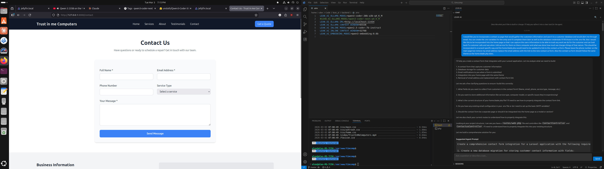

# Lean AI

**Your codebase already has an architect. It just needs tools.**

Lean AI is an agentic coding assistant that reads your project, plans changes, and executes them — all inside your editor. Give it a task in plain English, review the plan, and watch it work.

Run it fully local with [Ollama](https://ollama.com), or connect to OpenAI and Anthropic when you need heavier reasoning. Switch between models mid-session from the UI. No cloud account required to get started.



## Why Lean AI?

- **Plan first, then execute** — a 6-phase planning pipeline reads your codebase, traces data flow across files, and produces a structured plan before touching any code. You approve (or revise) before anything changes.
- **Multi-provider flexibility** — Ollama for free local inference, OpenAI for GPT-4o, Anthropic for Claude. Switch from the dropdown without restarting. Use cheap local models for small fixes, cloud models for hard problems.
- **Dual-model pipeline** — run a fast local model for codebase exploration and code execution, then automatically hand off to a cloud model (Claude, GPT-4o) for reasoning-heavy planning phases and complex fix attempts. Save cloud tokens for the decisions that matter.
- **Local Refiner** — when using cloud providers, a local Ollama model pre-processes your prompts: enriches them with private knowledge base context, strips sensitive data, and structures vague requests into detailed specs. Your proprietary docs never leave your machine. [Learn more](docs/knowledge-base.md)
- **Zero prompt engineering** — chat mode helps you refine ideas into detailed tasks. Project context and framework guides teach the LLM your codebase conventions automatically.
- **Knowledge base** — drop your internal docs (PDF, EPUB, Word, Markdown) into `.lean_ai/knowledge/` and the agent uses them for better plans without leaking content to cloud APIs.
- **Built-in code quality** — after every execution, Lean AI runs your project's linter and tests automatically. Failures are fed back to the LLM for self-correction. Lint, test, and format commands are auto-detected from your project files — zero configuration needed. When a test command is available, the agent writes tests alongside code changes.
- **Git-native workflow** — every task runs on its own branch. Approve to merge, reject to discard. Your main branch stays clean.
- **19 scaffold recipes** — bootstrap new projects (FastAPI, Next.js, Laravel, Rails, and more) with a single command.

## Quick Start

### 1. Install the backend

```bash
cd backend
pip install -e ".[dev]"
```

Need cloud providers or knowledge base support? See [optional extras](docs/configuration.md#installation-extras).

### 2. Start the server

```bash
uvicorn lean_ai.main:app --reload --port 8422
```

### 3. Install the extension

```bash
cd extension && npm install && npm run build
npx vsce package --no-dependencies
```

Install the `.vsix` in VSCodium/VSCode: **Extensions** sidebar > `...` menu > **Install from VSIX...**

### 4. Open a project and start chatting

The sidebar chat panel is your entry point. Describe what you want built, and the agent handles the rest.

## How It Works

```
You: "Add user authentication with JWT tokens"
                    |
          [Chat refines the idea]
                    |
          [6-phase planning pipeline]
            scope -> files -> design -> risks -> plan
                    |
          [You review and approve]
                    |
          [Agent executes step-by-step]
            creates files, edits code, writes tests
                    |
          [Post-execution validation]
            auto-format -> lint fix -> lint check -> test
            failures fed back to LLM for self-correction
                    |
          [Changes committed on a branch]
            /approve to merge, /reject to discard
```

**Two modes:**
- **`/agent`** — full planning pipeline for features and refactors
- **`/fix`** — skip planning, let the agent explore and fix directly

See [Architecture](docs/architecture.md) for the full breakdown.

## Slash Commands

| Command | What it does |
|---|---|
| `/init` | Index workspace and generate project context |
| `/agent` | Send a task to the planning pipeline |
| `/fix` | Skip planning, fix directly with full tool access |
| `/approve` | Merge the agent's branch |
| `/reject` | Discard the agent's branch |
| `/guide` | Regenerate framework guide |
| `/style` | Generate style guide from CSS/templates |
| `/scaffold` | Bootstrap a new project |
| `/reboot` | Restart the backend server |

## Configuration

Create a `backend/.env` file:

```env
# Provider — "ollama", "openai", or "anthropic"
LEAN_AI_LLM_PROVIDER=ollama

# Local model (default)
LEAN_AI_OLLAMA_MODEL=qwen3-coder:30b
LEAN_AI_OLLAMA_CONTEXT_WINDOW=128      # 128k — shorthand for 131072

# Cloud providers (optional — add API keys to enable)
LEAN_AI_OPENAI_API_KEY=sk-...
LEAN_AI_ANTHROPIC_API_KEY=sk-ant-...
```

### Dual-model setup (save cloud tokens)

Use a local model for the bulk of the work and a cloud model only for planning and complex fixes:

```env
# Primary: fast local model for exploration and implementation
LEAN_AI_LLM_PROVIDER=ollama
LEAN_AI_OLLAMA_MODEL=qwen3-coder:30b

# Expert: cloud model for planning phases (3-6) and final fix retry
LEAN_AI_EXPERT_LLM_PROVIDER=anthropic
LEAN_AI_ANTHROPIC_API_KEY=sk-ant-...
LEAN_AI_ANTHROPIC_EXPERT_MODEL=claude-opus-4-6
```

Or with OpenAI:

```env
LEAN_AI_EXPERT_LLM_PROVIDER=openai
LEAN_AI_OPENAI_API_KEY=sk-...
LEAN_AI_OPENAI_EXPERT_MODEL=gpt-4o
```

The expert model only runs for planning phases 3–6 (change design, risk assessment, plan assembly, verification) and the final validation fix retry. All codebase exploration, implementation, and routine tool calls use the primary local model.

> **Note:** the cloud provider's Python SDK must be installed even when the primary provider is Ollama — run `pip install -e ".[dev,anthropic]"` or `pip install -e ".[dev,openai]"` as appropriate, then restart the server.

See the [full configuration reference](docs/configuration.md) for all options.

## Documentation

| Guide | Description |
|---|---|
| [Configuration](docs/configuration.md) | All environment variables, extension settings, and model setup |
| [Architecture](docs/architecture.md) | Planning pipeline, workflow modes, tools, and internals |
| [Knowledge Base & Refiner](docs/knowledge-base.md) | Private docs, RAG enrichment, and cloud privacy |
| [API Reference](docs/api-reference.md) | REST endpoints and WebSocket protocol |
| [Extension Guide](docs/extension.md) | VSCode/VSCodium setup, commands, and settings |
| [Modelfile Guide](docs/modelfile.md) | Customizing Ollama models with persistent rules |
| [llama-server Guide](docs/llama-server.md) | Using llama.cpp as an alternative to Ollama |

## Requirements

- Python 3.10+
- Node.js 18+ (for the extension)
- At least one LLM provider:
  - **Ollama** with a capable model (e.g., `qwen3-coder:30b`) — free, local, no account needed
  - **OpenAI** API key (GPT-4o, etc.)
  - **Anthropic** API key (Claude, etc.)

Ollama is always required for inline predictions and embeddings, even when using cloud providers.

## Technology Stack

| Layer | Technology |
|---|---|
| Backend | Python, FastAPI, aiosqlite |
| LLM providers | Ollama, OpenAI, Anthropic |
| Code analysis | tree-sitter (13 languages) |
| Search | Whoosh BM25F + embedding RRF |
| Extension | TypeScript, VSCode API |

## License

MIT
